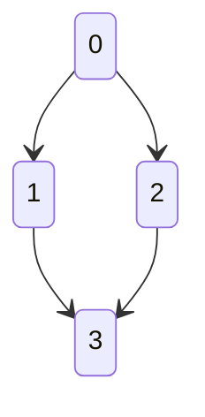
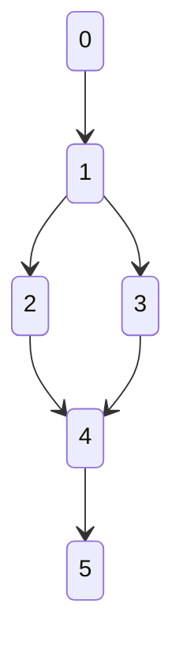
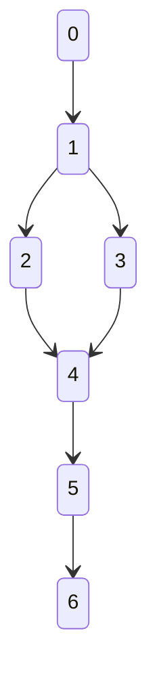

# Lattices.lp
Find models of lattices via Answer Set Programming (ASP).

## Answer Set Programming

To compute models of lattices, we use the ASP tooling offered by [Potassco](https://potassco.org/), colloquially refered to collectively as *clingo*.

## Representation

Lattices are represented as vertices $v$ with edges $e$ between them.

## Features

This library can:
- Decide if a given graph is a lattice
- Find the top and bottom elements of a lattice
- Find lattices that obey constraints you impose on a map from some original lattice
  - e.g. Find all lattices *b* that satisfy any map from lattice *a* that preserves the joins of *a*
  - e.g. Find all lattices *b* that satisfy any map from lattice *a* that preserves the meets and joins of *a*. i.e. a **lattice homomorphism**
  - e.g. Find all lattices *b* that satisfy any map from lattice *a* that preserves the meets and joins of *a*, and is one-to-one. i.e. a **lattice ismomorphism**

## Install and Run

Install `clingo` according to the [official instructions](https://github.com/potassco/clingo).

Instances of specific lattices are represented in `free_dist_2.lp` and `producer_consumer.lp`. `free_dist_2.lp` represents the free distributive lattice of 2 generators, and `producer_consumer.lp` represents two unrelated nodes which are both less than some top node, and greater than some bottom node.

Producer-Consumer:

Free Distributive Lattice of 2 Generators:


`lattices.lp` verifies that the original collection of edges specifies a lattice, `o`. It then finds a "bridgified" lattice `b` that is related to `o` such that there exists a lattice momorphism from one to the other that preserves joins, and satisfies other specific conditions. One could encode a lattice homomorphism by specifying that this morphism from `b` to `o` preserves all meets as well. The particular conditions used to specify a "bridgification" morphism are given in `lattices.lp`.

By default, for each example specific lattice, we specify that we only open one more vertex for interpretation. In other words, we allow the solver to consider lattices `b` with at most one more vertex than there are in the original lattice `o`. One can change how many more vertices are allowed by increasing the ranges in `free_dist_2.lp` and `producer_consumer.lp`.

One can select which relations they want to view (such as edges `e` or the leq relation `leq`) by commenting in/ out the appropriate `#show` directives in `lattices.lp`.

By passing `n 0` to `clingo`, we state that we want to examine all possible models for `b`. More command line arguments that control `clingo` can be found in the [official user guide](http://wp.doc.ic.ac.uk/arusso/wp-content/uploads/sites/47/2015/01/clingo_guide.pdf).

A typical execution then is:

```bash
$Lattices.lp> clingo free_dist_2.lp lattices.lp
clingo version 4.5.4
Reading from free_dist_2.lp ...
Solving...
Answer: 1
e(o,1,0) e(o,2,1) e(o,3,1) e(o,4,2) e(o,4,3) e(o,5,4) e(b,1,0) e(b,2,1) e(b,3,1) e(b,4,2) e(b,4,3) e(b,5,4) e(b,6,5) top(b,0) top(o,0) bot(b,6) bot(o,5)
SATISFIABLE

Models       : 1
Calls        : 1
Time         : 0.085s (Solving: 0.04s 1st Model: 0.02s Unsat: 0.02s)
CPU Time     : 0.062s
```
In this case, we observe that there is exactly 1 answer. Thus, there is exactly 1 lattice `b` such that applying a bridgification morphism to `b` produces `o`, when `b` has at most one more node than `o`. In this case, lattice `b` is like lattice `o` save for an extra edge below what was the bottom, 5, in the original lattice.

This is a visualization of the result:


## Origin

The original inspiration for Lattices.lp is the project I participated in at [Adjoint School 2023](https://adjointschool.com/2023.html) with:
- Mentor: Chris Heunen
- TA: Carmen Constantin and Nesta van der Schaaf
- Students: Ariadne Si Suo, Clémence Chanavat, Ariel Rosenfield, Luke Morris
